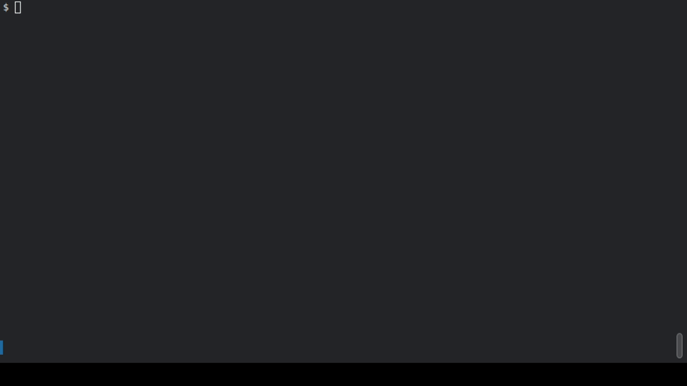

# Scriptty - Terminal Proxy Demo Engine

Create **realistic, reproducible terminal demos** for any interactive CLI — without depending on how the application echoes input.

This project runs a command-line program inside a pseudo-terminal (PTY), **decouples execution from presentation**, and renders scripted interactions as human-like typing.

Perfect for:
- README demos
- CLI tutorials

## Example demo for [rcypher](https://github.com/justpresident/rcypher/) CLI
Full script for the example is in [examples/rcypher.script](https://github.com/justpresident/scriptty/blob/master/examples/rcypher.script)

---

## Why This Exists

Tools like `expect`, `script`, and even `asciinema` struggle with realistic demos because:

- Input echo timing is controlled by the target application
- Keystrokes often appear only after a newline
- Readline-based apps redraw internally
- Typing realism is unreliable and brittle

**This tool solves that by design.**

Instead of relying on the application to echo input, it introduces a proxy that controls **what the viewer sees** independently from **what the program receives**.

---

## Installation
### Prebuilt binaries (recommended)

Download from the [stable release](https://github.com/justpresident/scriptty/releases/download/v0.1.0/scriptty)

### Build from source

scriptty is written in Rust. You’ll need the Rust toolchain installed.

**1. Install Rust**

If you don’t have Rust yet, install it with:

`curl --proto '=https' --tlsv1.2 -sSf https://sh.rustup.rs | sh`

Then restart your shell or run:

`source "$HOME/.cargo/env"`

Verify installation: `rustc --version`

**2. Clone the repository**
```
git clone https://github.com/justpresident/scriptty.git
cd scriptty
```

**3. Build the project**

`cargo build --release`

The binary will be available at: `target/release/scriptty`

You can run it directly:

`./target/release/scriptty --help`

**Optional: install globally**

If you want scriptty in your $PATH:

`cargo install --path .`


Then you can run:

`scriptty --help`

**Requirements**

* Linux or macOS (PTY support required)

* Rust 1.70+ (stable)

* A terminal that supports ANSI escape sequences

**Troubleshooting**

If the build fails on Linux, make sure you have:

* build-essential

* pkg-config

On macOS, make sure Xcode Command Line Tools are installed:

`xcode-select --install`

---

## Core Idea

> **Decouple program execution from terminal presentation.**

The program receives input instantly and deterministically.  
The viewer sees carefully timed output that looks like real typing.

```
┌────────────┐
│ Program    │ (runs in PTY)
└─────▲──────┘
      │
┌─────┴──────┐
│ Engine     │ (script + timing)
└─────▲──────┘
      │
┌─────┴──────┐
│ Renderer   │ (what the viewer sees)
└────────────┘
```

---

## Features

- 🧠 **Program-independent typing simulation**
- 🧪 Deterministic, scriptable demos
- ⌨️ Realistic per-character typing with jitter
- ⏱️ Controlled pauses and timing
- 📼 Compatible with asciinema recordings
- 🔁 Reproducible demos (great for CI)
- 🧩 Generic — works with *any* interactive CLI

---

## How It Works

1. The target program runs inside a **PTY**
2. A script drives interaction deterministically
3. Input is sent immediately to the program
4. Output is intercepted and re-rendered
5. Typing is simulated visually, not echoed

This avoids:
- line buffering
- terminal echo quirks
- readline redraw behavior
- race conditions

---

## Example Script

```text
# Display narration to the viewer
show "=== Configuration Demo ==="

# Wait for bash prompt
expect "$ "

# Type a command with realistic delays
type "put github.username littlejohnny"

# Wait for specific output before continuing
expect "saved"

show "Configuration saved! Now retrieving..."

# Small pause
wait 500ms

# Execute another command
type "get github.*"

# Wait for the output
expect "littlejohnny"
```

## Event Model

Internally, everything is an event:

```rust
enum Event {
    SendToProgram(Vec<u8>),
    ShowToUser(Vec<u8>),
    TypeText {
        text: String,
        min_delay: Duration,
        max_delay: Duration,
    },
    Sleep(Duration),
    Expect {
        pattern: String,
        timeout: Duration,
    },
}
```

**Program input and user-visible output are separate streams.**

## Script Commands

| Command | Syntax | Description |
|---------|--------|-------------|
| `wait` | `wait 1s` or `wait 500ms` | Pause execution for specified duration |
| `type` | `type "text here"` | Simulate realistic typing (50-150ms per char) |
| `send` | `send "text here"` | Send input instantly to program (not visible) |
| `show` | `show "message"` | Display text directly to viewer (narration, comments) |
| `expect` | `expect "pattern"` or `expect "pattern" 10s` | Wait for pattern in output (default 5s timeout) |

## Project Status

🚧 Early stage / design-first

## Planned next steps:

* YAML / JSON script format

* ANSI escape parsing (vt100)

* Built-in asciinema exporter

* Mistyped input simulation

* Redaction and masking rules

## Why Not Just Use Expect?

Because this tool solves a different problem.

| Tool         | Focus                               |
|--------------|:-----------------------------------:|
|expect        | Automate interaction                |
|asciinema     | Record terminals                    |
|this project  | Present interactions realistically  |

## Inspiration

This project grew out of real-world frustration trying to record high-quality demos of readline-based CLI tools where input appeared instant, robotic, or incorrect.

# License

Apache 2.0

# Contributing

Ideas, feedback, and design discussions are welcome.
If you’ve tried to record CLI demos and hit similar limits — you’re exactly the audience.
